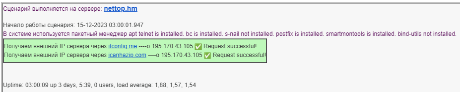
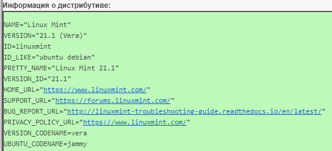
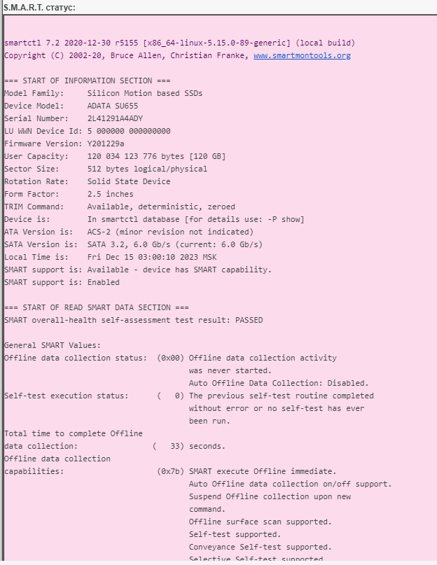
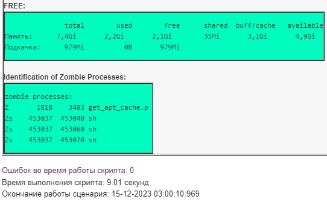

### mail reporter bash+python
a script for monitoring the state of the system with sending it to the mail






**Crontab**
```
crontab -e
30 3,6,9,12,15,18,21 * * * cd /opt/scripts/monitoring && /usr/bin/python3 /opt/scripts/monitoring/python_send_mail_smtplib_v2.py >> /opt/scripts/monitoring/protocol_smtplib_v2.txt 2>&1
```

Измените переменные с настройками почтового сервера под себя в файле <settings.py> 
```
server = 'smtp.mail.ru'
user = 'box@inbox.ru'
password = 'password'
sender = 'box@inbox.ru'
recipients = ['box@inbox.ru', 'box@mail.ru', 'mail3@yandex.ru', 'mail4@gmail.com']
```


